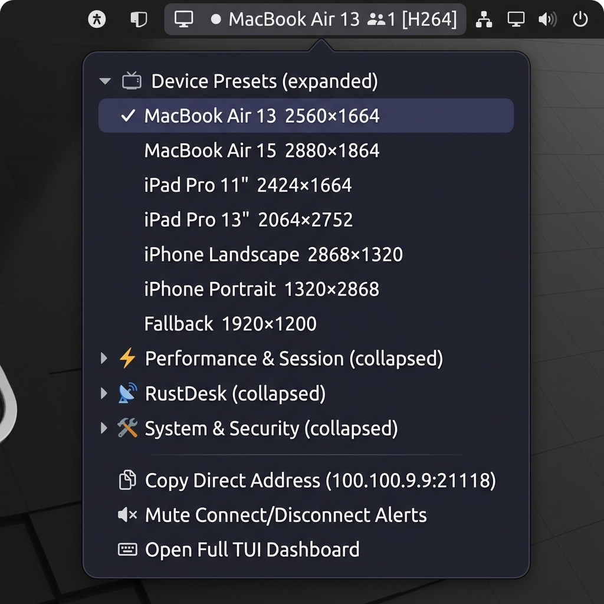
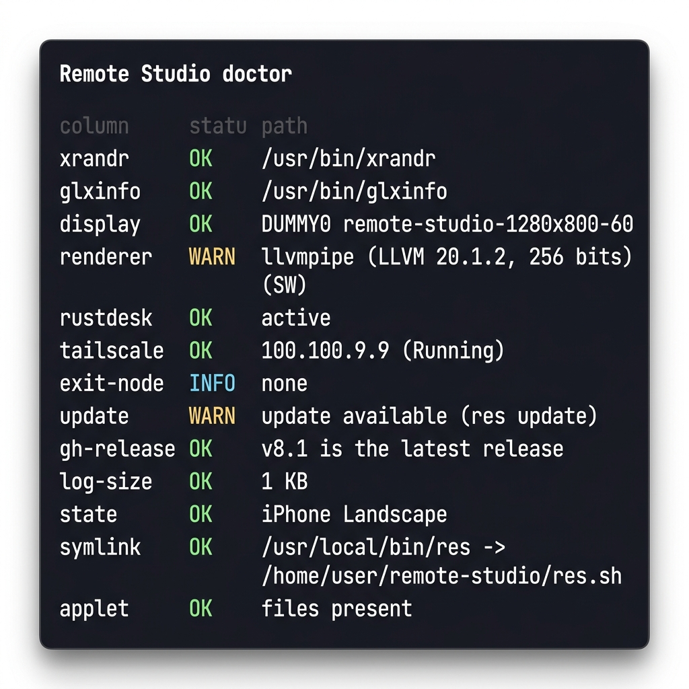
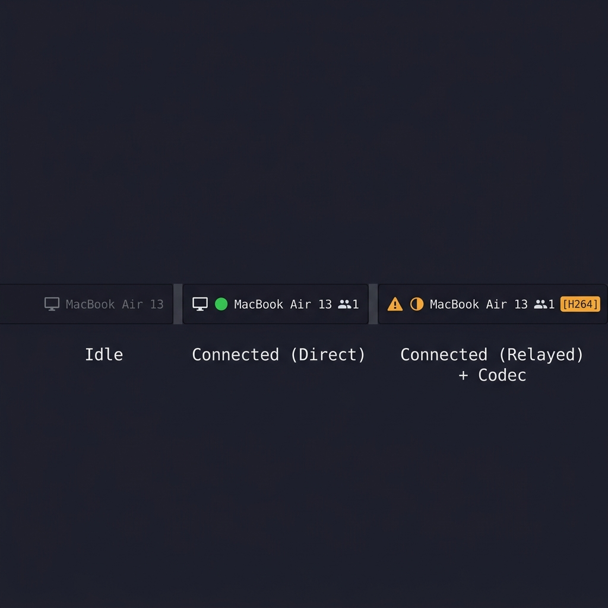

# Remote Studio — Quick Start Guide

Remote Studio manages your Linux display configuration for Apple device screen-sharing
via RustDesk. It applies the correct resolution, DPI scaling, cursor size, and colour
temperature for each device profile, and restores your desktop when the session ends.

---

## Prerequisites

| Dependency | Minimum | Install |
|---|---|---|
| `xrandr` | any | `sudo apt install x11-xserver-utils` |
| `glxinfo` | any | `sudo apt install mesa-utils` |
| `whiptail` | any | `sudo apt install whiptail` |
| `tailscale` | any | `curl -fsSL https://tailscale.com/install.sh \| sh` |
| `rustdesk` | 1.2+ | [rustdesk.com](https://rustdesk.com) |
| `git` | 2.x | `sudo apt install git` |
| Cinnamon DE | 5.2+ | (for the panel applet) |

Optional but recommended: `sensors` (thermal), `xclip` (Copy Direct Address), `powerprofilesctl`.

---

## Installation

### One-liner (recommended)

```bash
curl -fsSL https://raw.githubusercontent.com/NicoMancinelli/remote-studio/master/install-remote-studio.sh | bash
```

### Manual

```bash
git clone https://github.com/NicoMancinelli/remote-studio.git ~/dev/remote-studio
cd ~/dev/remote-studio
bash install.sh install
```

`install.sh` will:
- Symlink `res.sh` → `/usr/local/bin/res`  
- Symlink the Cinnamon applet into `~/.local/share/cinnamon/applets/`  
- Link `config/xsessionrc` → `~/.xsessionrc` (display restore on login)

Verify with:

```bash
res doctor
```

All rows should be **OK** (or **INFO**). Fix any **WARN** rows before proceeding.

---

## Core Concepts

### Profiles

Each profile encodes the full display configuration for one Apple device:

```
key=Label|width|height|scaling|text_scale|cursor_px
```

Built-in profiles live in `config/profiles.conf`. Add your own overrides in
`~/.config/remote-studio/profiles.conf` — user keys take precedence.

```bash
res profiles          # list all profiles + source file
res config set DEFAULT_PROFILE mac15   # change default
```

### State file

`~/.res_state` — one line recording the last applied configuration. Used by
`session stop` to restore the display when the remote user disconnects.

### Log

`~/.remote_studio.log` — timestamped event log. View with `res log [N]`.

---

## Daily Usage

### Switch device profile

```bash
res mac          # MacBook Air 13″  (2560×1664)
res mac15        # MacBook Air 15″  (2880×1864)
res ipad         # iPad Pro 11″     (2424×1664)
res ipad13       # iPad Pro 13″     (2064×2752)
res iphonel      # iPhone Landscape (2868×1320)
res iphonep      # iPhone Portrait  (1320×2868)
```

Or click the profile from the panel applet:



### Session management

```bash
res session start            # apply DEFAULT_SESSION_PROFILE, enable Speed Mode + Caffeine
res session start ipad       # explicit profile
res session stop             # restore previous display, disable Speed/Caffeine
res session status           # show active session details
```

Auto-session (opt-in): set `AUTO_SESSION=true` in `~/.config/remote-studio/remote-studio.conf`
and enable the watch service from **System & Security → Watch Service** in the TUI.

### Custom resolution

```bash
res custom 3024 1964 2       # apply 3024×1964 @2x; offers to save as a named profile
```

### Rotation

```bash
res rotate left     # landscape → portrait
res rotate normal   # back to landscape
```

### Quick toggles

```bash
res speed      # toggle performance power profile
res caf        # toggle caffeine (display sleep prevention)
res theme      # toggle dark/light theme
res night      # toggle night shift (colour temperature)
res privacy    # lock screen immediately
res fix        # re-sync clipboard, audio, and key bindings
res reset      # emergency display reset to 1280×800
```

---

## Diagnostics

```bash
res doctor
```



| Check | Meaning |
|---|---|
| `xrandr` / `glxinfo` | Required binaries present |
| `display` | Active Xrandr output detected |
| `renderer` | GPU driver (llvmpipe = software, expect lower performance) |
| `rustdesk` | systemd service active |
| `tailscale` | Tailnet IP + BackendState |
| `exit-node` | Active exit node or "none" |
| `update` | Local branch vs upstream |
| `gh-release` | Running version vs latest GitHub release |
| `log-size` | Log file size |
| `state` | Last applied profile |
| `symlink` | `/usr/local/bin/res` points to repo |
| `applet` | Cinnamon applet symlinks correct |

Fix all warnings automatically where possible:

```bash
res doctor-fix
```

Run the built-in self-test suite:

```bash
res self-test
```

---

## Tailscale

```bash
res tailnet                  # show IP + direct RustDesk address + exit node
res tailnet hosts            # list all peers with IPs
res tailnet peer macmini     # ping a specific peer
res tailnet doctor           # run tailscale netcheck
res tailnet exit-node        # show active exit node
```

---

## RustDesk

```bash
res rustdesk status          # session count, Direct/Relayed, remote IP, codec/FPS
res rustdesk log             # tail the RustDesk service log
res rustdesk apply quality   # apply quality preset to options.toml
res rustdesk apply speed     # apply speed preset
res rustdesk diff quality    # preview changes without applying
res rustdesk backup          # backup current options.toml
```

---

## Panel Applet

The Cinnamon panel applet shows live status at a glance:



| Label | Meaning |
|---|---|
| `MacBook Air 13` | Idle — mode name only |
| `● MacBook Air 13 👥1` | Direct connection, 1 user |
| `◐ MacBook Air 13 👥1` | Relayed via DERP, 1 user |
| `⚠ …` | Warning prefix — run `res doctor` |
| `[H264]` | Active codec shown when session active |

**Applet menu sections:**
- **📺 Device Presets** — switch profile; ✓ marks the active one; auto-expands when a session is active
- **⚡ Performance & Session** — Start/Stop session, Speed, Caffeine, Theme, Night Shift
- **📡 RustDesk** — quality presets, restart service
- **🛠 System & Security** — Privacy lock, Fix, Doctor, Tailnet, Reset

To reload the applet after updates: `Alt+F2` → `r` (restart Cinnamon).

---

## Configuration

User config lives at `~/.config/remote-studio/remote-studio.conf`:

```bash
res config show                         # print effective config
res config set DEFAULT_PROFILE mac      # display default
res config set DEFAULT_SESSION_PROFILE mac15  # session-specific default
res config set AUTO_SESSION true        # auto apply/restore on connect/disconnect
```

User profiles: `~/.config/remote-studio/profiles.conf`  
Format: `key=Label|width|height|scale|text_scale|cursor_px`

---

## Updates

```bash
res update          # git pull + re-run install.sh
res doctor          # verify after update
```

---

## TUI Dashboard

Run without arguments for the full whiptail TUI:

```bash
res
```

Or open it from the applet: **⌨ Open Full TUI Dashboard**.

Sections: Profiles · Performance · Diagnostics · System · Dashboard · Tailnet · Quick Actions · Help.

---

## File Locations

| Path | Purpose |
|---|---|
| `~/dev/remote-studio/` | Repository |
| `/usr/local/bin/res` | System-wide symlink |
| `~/.res_state` | Last applied display state |
| `~/.remote_studio.log` | Event log |
| `~/.config/remote-studio/remote-studio.conf` | User config |
| `~/.config/remote-studio/profiles.conf` | User profiles |
| `$XDG_RUNTIME_DIR/remote-studio/status` | Live status (read by applet) |

---

## Troubleshooting

**Display doesn't apply / `res mac` exits immediately**
- Check `$DISPLAY` is set: `echo $DISPLAY`
- Verify `xrandr` sees outputs: `xrandr --listmonitors`

**Applet shows no data / label stuck**
- Reload Cinnamon: `Alt+F2` → `r`
- Check applet symlinks: `res doctor` → `applet` row
- Check status file: `cat $XDG_RUNTIME_DIR/remote-studio/status`

**RustDesk shows "Relayed" instead of "Direct"**
- Ensure both machines are on the same Tailscale network
- Run `res tailnet doctor` — look for high latency or DERP-only path
- Check firewall: UDP port 21118 must be reachable

**`renderer WARN llvmpipe`**
- Software rendering is expected on headless/VM setups
- For hardware acceleration, ensure the correct GPU driver is installed
